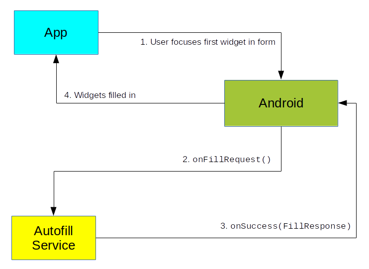
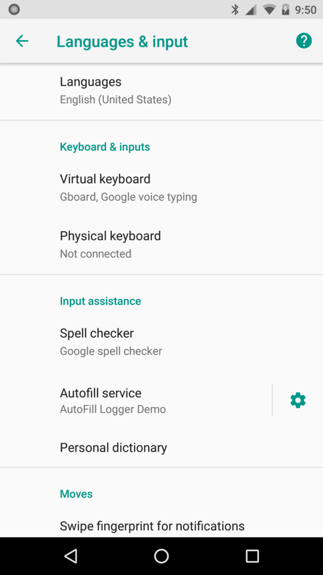
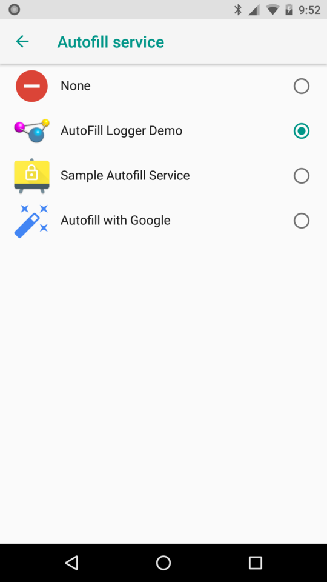

# Autofill Services and Security

A certain comics publisher loves to point out that "with great power comes
great responsibility". Autofill offers great power, particularly on Android,
where apps, not the framework, provide the actual autofill data storage and
management. This in turn places great responsibility on the shoulders of the
developers of such apps, particularly since autofill is insecure by design.

Specifically, malicious activities can request autofill data via invisible
widgets, or via widgets that cannot be seen for other reasons. The user
may not realize that by agreeing to fill in some visible widgets that data
for the unseen widgets will also get supplied with data. This can be used
to abscond with whatever the malicious app wants... subject to whatever
limitations the user's chosen autofill implementation imposes.

This paper will outline this security flaw in Android 8.0 autofill and what
Google feels is the responsibility of developers to help
partially mitigate that flaw.

## A Quick Primer on Android 8.0 Autofill

Typical autofill in a Web browser &mdash; such as Chrome &mdash; has only two
parties: the Web site and the browser. The browser is responsible for rendering
the Web content, presenting autofill options to the user, and saving off data
for future autofill requests.

In Android, there are three parties at minimum:

- The app that the user is interacting with

- An app supplying the user's chosen autofill service

- Android itself, serving as an intermediary between those apps

When the user visits some activity with a form and focuses a widget in that
form (e.g., an `EditText`), Android packages up details about that form and
sends it over to the autofill service. The autofill service does two things:

1. Says "Hey! I have some data from before that the user might want to autofill
into this form! Here it is!"

2. Registers interest in other form widgets for which the service does not have
autofill data now but would like to get the data after the user is done with 
the form, to save off for future autofill use

Android itself simply provides the communications path from the framework code
in the app with the form and the autofill service.

Android 8.0+ devices that are
part of the Google Play ecosystem should ship with a Google-supplied autofill service
("Autofill by Google") enabled by default. Users can install other autofill
services from the Play Store or elsewhere, then choose which of the installed
autofill services to use from within Settings. The user also has the option of
"None" as an autofill service, indicating that autofill should not be used at
all on the device.

## Security Requirements of Autofill Services

(NOTE: the material in this section is adapted from
[The Busy Coder's Guide to Android Development](https://commonsware.com/Android))

> Of course, a poorly written autofill provider can leak sensitive data.

That quote is from [a comment](https://issuetracker.google.com/issues/37140582#comment16)
on [a security issue](https://issuetracker.google.com/issues/37140582)
regarding a security flaw in Android 8.0's autofill implementation. While
those links may not work for you, as the issue is still locked at the time this
was written, it contains
a long chain of comments about this flaw and how Google expects the Android ecosystem
to deal with the flaw.

### First, the Flaw

Autofill will fill in widgets that the user cannot see, because:

- The widget is marked as invisible (`android:visibility="invisible"`)

- The widget has no size (width and height of `0dp`) or is impossibly tiny (width and height of `1dp`)

- The widget has negative margins that cause it to display off-screen

- The widget is behind some other opaque widget (on the Z axis), and so
the widget cannot be seen

There may be other similar scenarios. For example some discussion on the issue
suggests that autofill will supply data for a widget that does not exist at all
in the view hierarchy, but rather is faked by the activity as part of how it
populates the `ViewStructure` of information that goes to the autofill service.

Given this flaw, a malicious activity could obtain data that the user does not
realize will go to that activity. For example, the activity might have a field
for the user to confirm their postal code and have hidden widgets that collect
other data, such as the rest of the address, credit card details, usernames/passphrases,
etc.

This flaw can be demonstrated using
[Google's own sample autofill service](https://github.com/googlesamples/android-AutofillFramework),
though in the future that sample should be updated to show a more secure
implementation.

A copy of the flawed autofill service sample, along with a client demonstrating
how malicious activities can obtain data covertly from the autofill service,
can be found in [this GitHub repo](https://github.com/commonsguy/AutofillFollies).
Instructions for reproducing the problem can be found here as well.

### Google's Response

Google's engineers on
the security issue admit that the flaw exists and that it would be difficult,
if not impossible, to defend against malicious activities.

As such, Google is taking the approach of dumping this issue on the laps of 
the developers of autofill services. That is the context for the quote at the
top; Google believes that well-crafted autofill services will resolve this issue.
In the issue, Google has stated that their own autofill service implementation that ships
pre-installed and pre-enabled on Android 8.0 will be well-crafted.

There are two problems:

1. At present, there is little documentation or sample code on what a well-crafted
autofill service looks and works like, so many other developers looking to implement
autofill services are left in the dark

2. Their advice will not resolve the problem completely, though it will reduce the scope

### What Secure Autofill Services Need To Do

Unfortunately, the documentation for writing autofill services is limited and
does not address very well the issue of how to write a secure autofill service.

Instead, Google "work[s] closely with most major autofill providers", focusing
on that instead of documentation, sample code, and public test suites. This approach
is difficult to defend, given that there may be entire markets for which Google's
efforts have no impact (e.g., China, if none of the "major autofill providers"
distribute their apps there).

So, what is it that Google is expecting autofill service developers to do?

#### Partition the Dataset

The one bit of advice that Google has published publicly (as of the time this
was written) was to partition the dataset. This involves two steps:

1. Cluster the possible requested autofill hints into partitions (e.g., address/phone
versus credit card versus username/password)

2. Only hand back the data for one partition at a time, based on what
widget has the focus at the time the autofill request is made of the service

So, for example, suppose the form has fields for address, phone number, and
the typical batch of credit card details (number, name, expiration date, etc.)
A poorly-crafted autofill service provides autofill data for all of that when
Android asks for it... despite the fact that this is what the API would appear
to expect the autofill service to do. Instead, you need to:

- Identify which widget has the focus

- Determine which partition (address/phone or credit card) that widget belongs
to

- Only supply autofill data for that partition on this request

Later on, if the user puts the focus on a field that is eligible for autofill
but for which you did not provide the data previously, you will get a second
chance at the same form, where you repeat the process, only supplying autofill
data for the partition associated with the now-focused partition.

See the "Data Partitioning" section in
[the `AutofillService` JavaDocs](https://developer.android.com/reference/android/service/autofill/AutofillService.html)
for complete details.

#### Only Give Data Back to the App That Supplied It

Another bit of advice: only give data back
to the app that supplied it, for anything that you or the user might consider
to be sensitive.

On the Web, some autofill works across all domains. Data that you fill into a form
on one Web site can be captured by the browser and offered up as candidate
responses on other sites, including ones that you have never visited before.
If the user fills in an email address for Site A, that email address is available
to supply via autofill to Site B.

The equivalent behavior with Android's autofill would be for the autofill
service to have a single pool of data that could be autofilled-in for any app.
If the user fills in an email address for App A, that email address is available
to supply via autofill to App B.

Google feels that this is fine, so long as the data is not something that the
user would consider to be sensitive. In particular, they recommend that usernames
and passwords be locked to an individual app and not pooled, which makes perfect
sense. For such sensitive content, an autofill service must only provide data back to the specific app
that supplied it, via a combination of the `applicationId` ("package")
of the app and the public signing key of that app:

> An autofill provider must verify the *package+signature* to prevent phishing - this guarantees that even if a sideloaded app uses another app’s package name and mimics its UI cannot get access to sensitive data associated with it.

As of 8 August 2017, this "only give data back
to the app that supplied it" requirement is undocumented, outside of the
aforementioned security issue. According to the developers, it will be documented
sometime in the future.

#### Hint to the User What Data Is Being Autofilled In

The autofill service API has support for the service to require authentication
before actually providing the autofill data. In a nutshell, the service creates
a `PendingIntent` pointing to the authentication activity associated with the
autofill service and includes that `PendingIntent` in its response to an autofill
request. If the user elects to proceed, the `PendingIntent` is used to display
the authentication activity. If the user successfully authenticates, the user
is returned to the activity they had been on previously, but now the secured
autofill data should now be available for use.

For anything that is deemed sensitive, Google not only recommends that autofill
services use this authentication flow, but that the authentication activity
display details of exactly what data will be released. This way, for whatever
autofill request triggered the authentication, the user will be informed about
all fields that would be filled in... including those that the user cannot see.

This requirement is also undocumented as of 8 August 2017.

### What Google's Advice Does Not Solve

There are gaps in Google's advice.

First, there is no real enforcement that any autofill service follow the advice.
This might be checked manually for the Play Store:

> However, we’ll have a manual procedure in place to verify such compliance for apps that want to be list as an Autofill service option in the “Add Autofill Service” Play Store page that is launched from Settings.

How well this works, and whether any other app distribution channel will implement
similar checks, remains to be seen. Similarly, whether any security firms or
other independent parties offer some sort of compliance check remains to be seen.

Second, the "only give data back to the app that supplied it" rule will fail
for apps for whom the form and the data come from outside the app... such as
for Web browsers. There, the app is the *browser*, not the Web site. The autofill
service has no obvious means of distinguishing one site from another, or even that
there is a concept of "site" that needs to be taken into account.

Third, what the *user* considers to be sensitive data, what *Google* considers to
be sensitive data, and what *autofill service developers* consider to be sensitive
may differ. For example, the user might be rather concerned about their address
being made available. But if the autofill service developers do not consider
that to be sensitive data, Google's recommendations may be ignored. In particular,
if you implement the partitioning, but do not limit data sharing between apps,
a malicious activity can still steal data within a single partition, such as
obtaining all the credit card details when just asking visibly for the
expiration year.

Fourth, the hint-when-authenticating approach helps, but a malicious activity
can defeat simple implementations, by requesting multiple partitions and setting
the focus such that an innocuous partition is requested first. For example, the
malicious activity's form might have visible fields for email address and postal
code, followed by invisible fields for the rest of the address. Putting the email
address field first and giving it the focus will cause any authentication to happen
for the email partition. If the authentication activity only hints to the user
about fields that will be autofilled in from that one partition, the user will
only be told about the visible email address field. Authentication should not be
required when the user advances to the postal code field, as the user just
authenticated, and so the user might not receive the hint about the hidden
address fields after the postal code field.

## What Users Should Do

Users of Android 8.0+ devices should disable autofill unless they have
a very clear need for that functionality.
At the time this was written, Android 8.0 is in a "developer preview" state,
and so it may change. But, as of this preview, to disable autofill,
go into Settings > System > Languages &amp; input > Advanced and find the
"Autofill service" preference:

Tap on that preference itself (not on the gear) to bring up a list of autofill
service providers:

Choose "None" to disable autofill.

Users who find themselves repeatedly entering the same data &mdash; and hence may
benefit from autofill &mdash; should take some steps to ensure that they are using
a well-crafted autofill service provider. Unfortunately, it is not clear exactly
how users will be able to do this.

## What Autofill Service Developers Should Do

Besides "not write an autofill service", developers should:

- Keep a very close eye on any security advice Google gives regarding proper
autofill service implementation. Bear in mind that Google may be very slow in
providing such advice.

- Keep a very close eye on any reports from security analysis firms regarding
systemic flaws in autofill, so you can address those flaws as best you can

- If security analysis firms offer some specific testing service for autofill
providers, take advantage of them

- Consider other protocols for this sort of thing, such as
[OpenYOLO](https://github.com/openid/OpenYOLO-Android), which may offer some
of the same benefits for user credentials with a more focused API

## Acknowledgments

Mark Murphy, the author of this paper, would like to thank the Google engineers
who worked on the aforementioned security issue, for helping to identify what
autofill service developers need to know.

He would also like to thank Paul Blundell of Novoda, whose comments on
[this blog post](https://www.novoda.com/blog/o-h-yeah-what-we-look-forward-to-in-android-o/)
triggered the research in this area.

## Timeline of Events

- 21 March 2017: Google releases O Developer Preview 1, containing the first edition of the autofill APIs
- 23 March 2017: Novoda publishes [this blog post](https://www.novoda.com/blog/o-h-yeah-what-we-look-forward-to-in-android-o/), wherein Paul Blundell mentions the possibility of security issues related to autofill
- 23 March 2017: Mark Murphy reads that blog post and worries
- 24 March 2017: Mark Murphy finds the security flaw outlined in this paper, then curses loudly, possibly disturbing his neighbors
- 24 March 2017: Mark Murphy files [a security issue](https://issuetracker.google.com/issues/37140582) with Google
- 23 May 2017: Mark Murphy reproduces the flaw on O Developer Preview 2 and updates the issue with this information
- 12 June 2017: Mark Murphy reproduces the flaw on O Developer Preview 3 and updates the issue with this information
- 25 June 2017: Mark Murphy points out on the issue that it is over the 90-day responsible disclosure threshold and wonders if anyone at Google is looking at this issue
- 27 June 2017: Google responds with "we're looking at it"
- 30 June 2017: Google responds with the first bits of information about the undocumented requirements for autofill services
- 30 June 2017 through 31 July 2017: Mark Murphy and Google engineers discuss the problem at length on the issue, with Google providing all indications that this is working as intended, despite not officially changing the issue's status to this state
- 8 August 2017: Mark Murphy publishes this white paper
